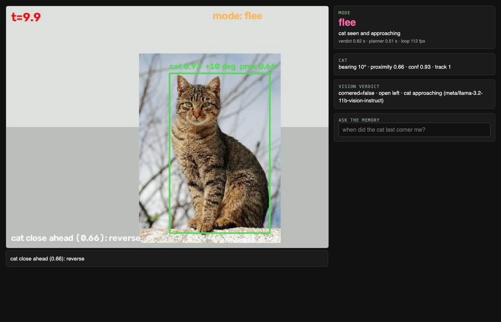

# Every Cat is the Villain in their Own Story

A robot mouse that recognizes and flees from any cat it sees, records every escape, and answers plain-language questions about its own footage.
Built for the tokens& / VAST Data Real-Time Video Agents Hack, San Francisco, 2 Oct 2026.

> Provenance: this repo starts on hack day from a prototype written 28 Sep to 1 Oct 2026 (simulator, fake car, policy, dashboard). Commits from 2 Oct onward are hack-day work.

A tennis-ball-sized-ish robot that runs away from a cat, and remembers every escape.
Built for the Real-Time Video Agents Hack, SF, 2 Oct 2026.

Hardware: Elegoo Smart Robot Car V4 with camera (Arduino UNO + ESP32-WROVER cam). All vision runs on the MacBook.
Plan: eight modules that talk JSON. See the build plan and the two research pages on the HQ hub.

    car.py         Elegoo link: MJPEG in, JSON drive commands out, heartbeat, watchdog
    perceive.py    YOLO cat detection + tracking, Depth Anything free space  -> Threat, FreeSpace
    reflex.py      pure policy: Threat + FreeSpace + Mode -> Command
    recorder.py    5 s clips + events.jsonl
    supervisor.py  Cosmos Reason 2 verdict every 3 s, W&B LLM mode planner, Weave traces
    memory.py      captions -> embeddings -> vector search; "when did the cat last corner me?"
    dash.py        live view, mode, query box, clip playback
    sim.py         replay a recorded or phone video as the car

## Run

    # simulator, no hardware (keys from the keychain)
    claude-secrets run --inject NVIDIA_API_KEY=NVIDIA_API_KEY --inject WANDB_API_KEY=WANDB_API_KEY -- \
      .venv/bin/python main.py --sim sim_cat.mp4 --dash          # open http://localhost:8000
    # the real car: join Wi-Fi ELEGOO-xxxxxxxx, USB-tether the iPhone for internet, then drop --sim
    # ask the memory from the terminal
    .venv/bin/python memory.py "when did the cat last corner me?"
    # policy tests
    .venv/bin/python -m pytest -q tests

## Test without the car

    .venv/bin/python sim2d.py --policy reflex --seed 6 --video run.mp4     # closed-loop room, ray-cast camera, scores the policy
    .venv/bin/python fake_elegoo.py --video-port 8081 --cmd-port 8100 &   # speaks the Elegoo firmware protocol over the sim room
    .venv/bin/python main.py --host 127.0.0.1 --video-port 8081 --cmd-port 8100 --no-cloud --seconds 30

Panic: on the first sighting of a cat (5 s cooldown) the dashboard plays assets/panic.mp4 over the camera
(PANIC_VIDEO=/path/to/any.mp4 to swap it) and the car's RGB LEDs flash red for 1.5 s (firmware N=8).
The cloud planner narrates by default; --cloud-steers lets its mode drive (measured worse on the fake car).
The dashboard prefers assets/local/panic_run_morty.mp4 (untracked; first 4.4 s of youtube.com/shorts/uke88yBbyik,
cut with ffmpeg) and falls back to the generated assets/panic.mp4. Demo videos: record with --demo-video and
fake_elegoo.py --topdown, then `compose_demo.py cam.mp4 top.mp4 out.mp4` pairs the two by timestamp.

## Play it

    ./demo.sh          # fake Elegoo in the Doom room + the full agent; open http://localhost:8000, click Start

## First hookup with the real car (run this first)

    .venv/bin/python preflight.py      # 9 steps: network, video, heartbeat, ultrasonic, wheels-up motor test,
                                       # lights, floor spin/speed/deadband, disconnect failsafe, cat detection
Results land in demo_logs/preflight.json, with the constants to change. Every byte on the control link is logged
to demo_logs/car_wire.log. The car link budgets the 9600-baud ESP32->UNO serial link (about 960 bytes/s):
drive commands only when they change plus a 10 Hz keepalive, ultrasonic polled at 5 Hz in the background.
